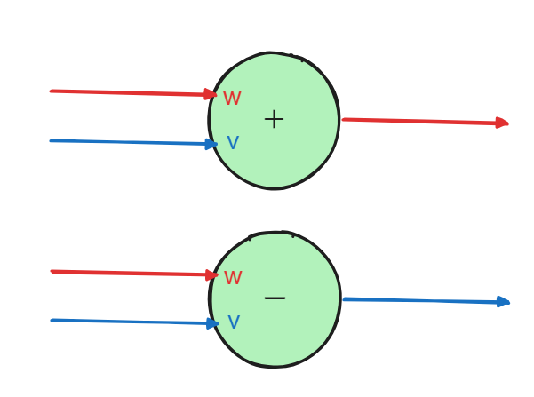
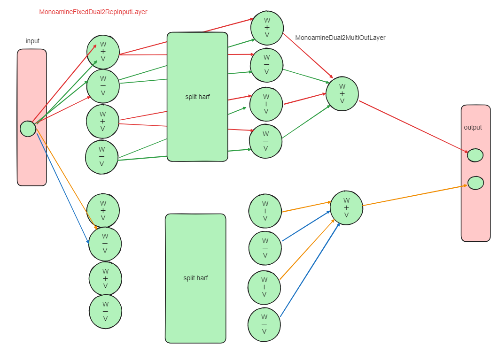

<!-- PROJECT SHIELDS -->

[![GitHub License][license-shield]][license-url]

[![Paypal][Paypal-shield]][Paypal-url][![BuyMeACoffee][BuyMeACoffee-sheild]][BuyMeACoffee-url]

<!-- PROJECT LOGO -->
 

  

  <h3 align="center">Error Diffusion Model</h3>

  

    誤差逆伝搬に変わる誤差拡散法を誤差逆伝搬で実装
     
    <a href="https://github.com/Shumpei-Tanaka/error-diffusion-model/issues">Report Bug</a>
    ·
    <a href="https://github.com/Shumpei-Tanaka/error-diffusion-model/issues">Request Feature</a>
  

  

    <a href="/docs/readme-en.md">English</a> •
    <a href="/readme.md">日本語 (Japanese)</a>
  

## 概要

金子氏考案の Error Diffusion (ED)の pytorch での実装

モノアミン系のシミュレートとのことのため、Monoamine Layer と命名

ED 法に則って学習するモデルを構築するための layer と

その使用例として MNIST での学習スクリプトを作成

参考元：[web archive](https://web.archive.org/web/20000306212433/http://village.infoweb.ne.jp:80/~fwhz9346/ed.htm)

(<a href="#readme-top">back to top</a>)

## ED 法について

### 思想

参考元ではソースコードが付属しているが、このリポジトリの実装では torch での実装にあたり多岐にわたる変更を施している

次図に参考元にある出力増加・現象時の各シナプスの結合強度を増加させる位置を示す。

この図から、出力と教師データの誤差から各結合へのフィードバック経路が一意に決まることに焦点を当て実装した。

１つのニューロンは興奮性・抑制性の２つの入力値から、興奮性・抑制性どちらか一方を出力する。

興奮性入力$in_p$、抑制性入力$in_n$、興奮性重み$w$、抑制性重み$v$、自己符号$s$を定義する。この時出力$out$は
$$out = s \times (in_p * w - in_n * v)$$

これにより１つのニューロンとしての演算が定義できる。この様子を次の図に示す。

この実装により明確に w,v と重みを分けられる。

重み更新差分$d_w$、$d_v$は出力誤差差分$d_e$と自己符号$s_{self}$、入力$in_p$、$in_n$により定義できる。

$$d_w = s \times d_e \times in_p$$
$$d_v = -s \times d_e \times in_n$$

$w$は出力を大きくしたい場合に増加、小さくするために減少

$v$は出力を大きくしたい場合に減少、小さくするために増加

また、$d_e$は出力層からそのまま伝達する。

原理上経路は初めから固定しているため、同じ値を共有して使用することができる。

### 実装

次の図のようになっている。

-   MonoamineFixedDual2RepInputLayer にて十分な数を複製
    -   出力数: $input \times n$
-   MonoamineFixedDual2MidLayer にて２つずつ組み合わせる
    -   出力数: $input \div  2$
    -   任意回数繰り返す
-   MonoamineDual2MultiOutLayer にて１出力ずつまとめ上げる
    -   出力数: $output$
    -   制約: $output \mod input = 0$

最初に必要なだけ複製し、経路を出力ごとに固定する

torch の backward を利用して実現するために、出力以外の活性化層をバイパスして直接各層に出力誤差を与えている。

(<a href="#readme-top">back to top</a>)

## Contributing

協力は歓迎です。Issue か Pull Request をください

(<a href="#readme-top">back to top</a>)

<!-- LICENSE -->

## License

The source code is licensed MIT. See [LICENSE.md][license-url].

(<a href="#readme-top">back to top</a>)

<!-- CONTACT -->

## Contact

-   Shumpei-Tanaka
    -   s6.tanaka.pub@gmail.com

(<a href="#readme-top">back to top</a>)

<!-- Suppurt -->

## Say Thank You

役立ったら ↓ から支援もらえたら嬉しい

-   [https://www.paypal.me/s6tanaka][Paypal-url]
-   [https://www.buymeacoffee.com/s6tanaka][BuyMeACoffee-url]

[![Paypal][Paypal-shield]][Paypal-url][![BuyMeACoffee][BuyMeACoffee-sheild]][BuyMeACoffee-url]

(<a href="#readme-top">back to top</a>)

[release-shield]: https://img.shields.io/github/v/release/Shumpei-Tanaka/readme-template?style=flat-squere&sort=semver
[release-url]: https://github.com/Shumpei-Tanaka/error-diffusion-model/releases/latest
[license-shield]: https://img.shields.io/github/license/Shumpei-Tanaka/readme-template?flat-squere
[license-url]: /LICENSE.md
[contributors-shield]: https://img.shields.io/github/contributors/Shumpei-Tanaka/readme-template.svg?style=flat-squere
[contributors-url]: https://github.com/Shumpei-Tanaka/error-diffusion-model/graphs/contributors
[forks-shield]: https://img.shields.io/github/forks/Shumpei-Tanaka/readme-template.svg?style=flat-squere
[forks-url]: https://github.com/Shumpei-Tanaka/error-diffusion-model/network/members
[stars-shield]: https://img.shields.io/github/stars/Shumpei-Tanaka/readme-template.svg?style=flat-squere
[stars-url]: https://github.com/Shumpei-Tanaka/error-diffusion-model/stargazers
[issues-shield]: https://img.shields.io/github/issues/Shumpei-Tanaka/readme-template.svg?style=flat-squere
[issues-url]: https://github.com/Shumpei-Tanaka/error-diffusion-model/issues
[Paypal-shield]: https://img.shields.io/badge/paypal.me-s6tanaka-white?style=flat-squere&logo=paypal
[Paypal-url]: https://paypal.me/s6tanaka
[BuyMeACoffee-sheild]: https://img.shields.io/badge/buy_me_a_coffee-s6tanaka-white?style=flat-squere&logo=buymeacoffee&logocolor=#FFDD00
[BuyMeACoffee-url]: https://www.buymeacoffee.com/s6tanaka
[github-flow-url]: https://docs.github.com/en/get-started/quickstart/github-flow
[semver-url]: https://semver.org/
